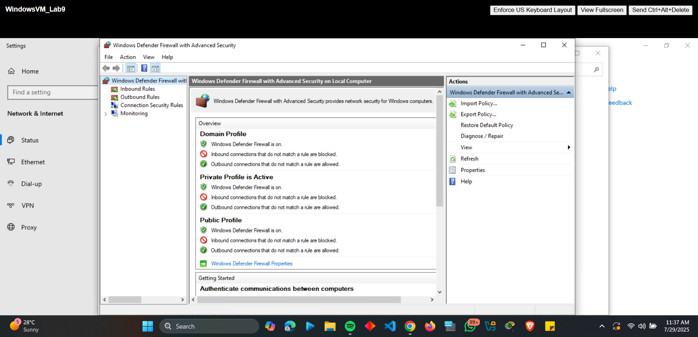

# Project: Windows Firewall Hardening with ICMP Filtering

## Overview
This project demonstrates advanced Windows Defender Firewall configuration to implement strict network segmentation using the principle of least privilege. The setup allows ICMP (ping) traffic exclusively between two specific IP addresses while blocking all other network communication, creating a secure micro-segmentation environment.

---

## Configuration & Screenshots

### 1. Initial Firewall Status Verification
- Verified Windows Defender Firewall was active on all profiles
- Confirmed default inbound/outbound rule sets
- Established baseline security configuration


*Windows Defender Firewall active across all network profiles*

### 2. Disabling Default Firewall Rules
- Disabled all existing inbound rules to eliminate default allowances
- Disabled all existing outbound rules to prevent unauthorized communications
- Created clean slate for custom rule implementation


*All default inbound rules disabled for custom configuration*


*All default outbound rules disabled to prevent unauthorized communications*

### 3. Custom ICMP Rule Creation
- Created inbound rule allowing ICMPv4 Echo Request from specific source IP
- Created outbound rule allowing ICMPv4 Echo Reply to specific destination IP
- Configured rules with precise protocol specifications and IP restrictions


*Custom inbound rule allowing ICMP only from trusted source IP*


*Custom outbound rule allowing ICMP responses only to trusted destination IP*

### 4. Connectivity Validation Testing
- Verified successful ICMP communication between authorized hosts
- Confirmed blocking of all non-ICMP traffic types
- Tested rejection of ICMP traffic from unauthorized sources


*Successful ICMP communication between authorized hosts*


*Network configuration verification showing trusted source IP*


*Comprehensive connectivity testing confirming proper rule enforcement*

---

## Observations and Challenges

### Technical Implementation Challenges
- **Rule Precedence Complexity**: Understanding rule processing order was critical to avoid conflicts
- **Protocol Specificity**: Required precise configuration of ICMPv4 Echo Request vs. general ICMP
- **Profile Management**: Ensuring consistency across Domain, Private, and Public firewall profiles

### Configuration Risks
- Potential complete network isolation if rules misconfigured
- Risk of locking out administrative access during testing
- Dependency on accurate IP addressing for trusted communications

### Performance Considerations
- Minimal performance impact due to protocol-specific filtering
- Efficient rule processing with limited rule set
- Low overhead for ICMP-specific network monitoring

---

## Lessons Learned

### Security Architecture Principles
- **Default-Deny Approach**: Implementing block-all then allow-specific methodology
- **Micro-Segmentation Value**: Creating precise communication channels between specific hosts
- **Least Privilege Enforcement**: Granting minimal necessary network permissions

### Operational Best Practices
- **Testing Methodology**: Implementing staged rule deployment with validation at each step
- **Documentation Importance**: Maintaining detailed rule descriptions and purposes
- **Backup Procedures**: Saving original configurations for emergency restoration

### Protocol Understanding
- **ICMP Operational Characteristics**: Understanding Echo Request vs. Echo Reply behaviors
- **Windows Filtering Platform**: Leveraging advanced filtering capabilities
- **Network Troubleshooting**: Using controlled ICMP for connectivity verification

---

## How to Reproduce

### Prerequisites
- Windows 10/11 system with Windows Defender Firewall
- Administrative privileges
- Static IP addresses for both communicating hosts
- Network connectivity between target systems

### Implementation Steps

1. **Access Advanced Firewall Interface**
```powershell
# Open Windows Defender Firewall with Advanced Security
wf.msc

# Export current rules for backup
netsh advfirewall export "C:\firewall_backup.wfw"

# Disable all inbound rules (run in PowerShell Admin)
Get-NetFirewallRule -Direction Inbound | Disable-NetFirewallRule

# Disable all outbound rules
Get-NetFirewallRule -Direction Outbound | Disable-NetFirewallRule

# Create inbound ICMP rule
New-NetFirewallRule -DisplayName "Lab9_ICMP_Firewall_inbound" `
-Direction Inbound -Protocol ICMPv4 -IcmpType 8 `
-RemoteAddress 10.119.22.172 -Action Allow -Enabled True

# Create outbound ICMP rule
New-NetFirewallRule -DisplayName "Lab9_ICMP_Firewall_outbound" `
-Direction Outbound -Protocol ICMPv4 -IcmpType 0 `
-RemoteAddress 10.119.22.172 -Action Allow -Enabled True

# Verify rule configuration
Get-NetFirewallRule -DisplayName "Lab9_ICMP*" | Format-Table DisplayName,Enabled,Direction,Action

# Test connectivity
Test-NetConnection -ComputerName 10.174.237.122 -InformationLevel Detailed

# Check firewall status
Get-NetFirewallProfile | Format-Table Name, Enabled